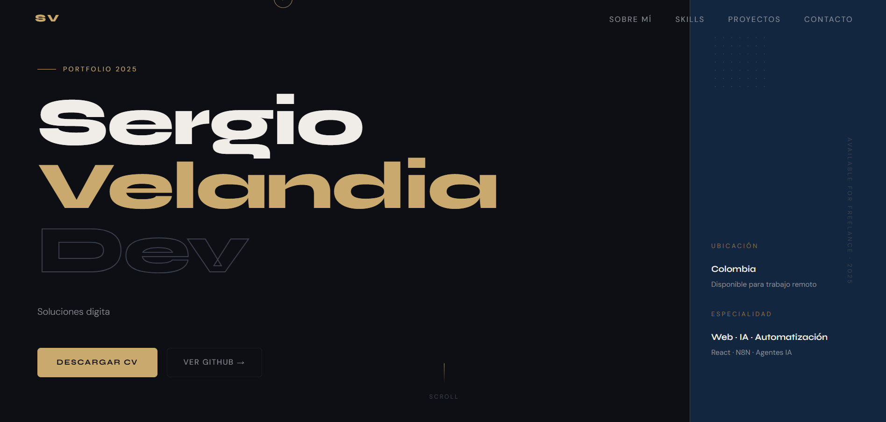

<div align="center">

# ✦ Sergio Velandia — Portafolio Personal

**Desarrollador web y automatizaciones — Colombia**

[](https://react.dev/)
[](https://vitejs.dev/)
[](https://www.emailjs.com/)
[](https://sergio-velandia.github.io/mi-portafolio/)

[🌐 Ver en vivo](https://sergio-velandia.github.io/mi-portafolio/) · [📬 Contacto](mailto:sergio.velandiar.z@gmail.com)

</div>

---

## 📸 Preview

> _Agrega aquí un screenshot del hero — arrastra la imagen a la carpeta `/public` y referénciala así:_



---

## 🗂 Estructura del proyecto

```
mi-portafolio/
├── public/
│   ├── favicon.svg
│   ├── favicon.png
│   ├── apple-touch-icon.png
│   ├── android-chrome-192x192.png
│   ├── android-chrome-512x512.png
│   ├── site.webmanifest
│   └── Preview.png
└── src/
    ├── assets/
    ├── components/
    │   ├── Header.jsx          # Hero con typewriter y cursor personalizado
    │   ├── SobreMi.jsx         # Sobre mí — descripción personal
    │   ├── Habilidades.jsx     # Grid de habilidades con colores por tech
    │   ├── Proyectos.jsx       # Tarjetas de proyectos web
    │   ├── N8nProyecto.jsx     # Proyecto destacado de automatización n8n
    │   ├── RobloxProyecto.jsx  # Proyecto ExplosionArt en Roblox Studio
    │   ├── Experiencia.jsx     # Timeline de experiencia profesional
    │   ├── Certificaciones.jsx # Certificados SENA (Python, Java, MySQL)
    │   ├── Stats.jsx           # Estadísticas animadas con contadores
    │   ├── Stackactual.jsx     # Stack del día a día + lo que estoy aprendiendo
    │   ├── Contacto.jsx        # Formulario funcional con EmailJS
    │   └── Footer.jsx
    ├── App.jsx
    ├── App.css                 # Sistema de diseño completo (variables, animaciones)
    ├── index.css
    ├── animation.js            # IntersectionObserver para reveal / stagger
    ├── extras.js               # Cursor personalizado, scroll-to-top, toast
    └── main.jsx
```

---

## ⚡ Tech Stack

### Frontend
| Tecnología | Uso |
|---|---|
| **React 18** | Componentes y lógica de UI |
| **Vite 5** | Bundler y dev server |
| **CSS Variables** | Sistema de diseño con paleta 70-20-10 |
| **Google Fonts** | Syne (display) + DM Sans (body) |
| **React Icons** | Íconos de contacto y UI |

### Integraciones
| Servicio | Uso |
|---|---|
| **EmailJS** | Formulario de contacto sin backend |
| **GitHub Pages** | Deploy estático gratuito |

### Herramientas de desarrollo
| Herramienta | Uso |
|---|---|
| **VS Code** | Editor principal |
| **Git + GitHub** | Control de versiones |
| **n8n** | Automatizaciones en producción |
| **Vercel / GitHub Pages** | Deploy |

---

## 🎨 Sistema de diseño

El portafolio usa una paleta **70-20-10** definida en variables CSS:

```css
--bg-base:      #0d0f14   /* 70% — negro grafito cálido  */
--bg-surface:   #12263F   /* 20% — azul medianoche       */
--accent:       #C9A96E   /* 10% — oro bronce mate       */
```

**Tipografía:** `Syne` para títulos y display — `DM Sans` para cuerpo de texto.

---

## 🚀 Correr localmente

```bash
# 1. Clona el repositorio
git clone https://github.com/Sergio-Velandia/mi-portafolio.git
cd mi-portafolio

# 2. Instala dependencias
npm install

# 3. Corre el servidor de desarrollo
npm run dev
```

Abre [http://localhost:5173](http://localhost:5173) en tu navegador.

---

## 📬 Configurar el formulario de contacto

El formulario usa [EmailJS](https://www.emailjs.com/) (plan gratuito — 200 emails/mes). Para activarlo:

1. Crea una cuenta en emailjs.com
2. Conecta tu cuenta de Gmail como servicio
3. Crea un template con las variables `{{from_name}}`, `{{reply_to}}` y `{{message}}`
4. Reemplaza las constantes en `src/components/Contacto.jsx`:

```js
const EMAILJS_SERVICE  = "service_xxxxxxx"
const EMAILJS_TEMPLATE = "template_xxxxxxx"
const EMAILJS_KEY      = "xxxxxxxxxxxxxxxxx"
```

---

## 📄 Licencia

Este proyecto es de uso personal. Puedes inspirarte en el código pero no redistribuirlo como propio.

---

<div align="center">
  Hecho con mucho café ☕ por <strong>Sergio Velandia</strong> — Colombia 🇨🇴
</div>
